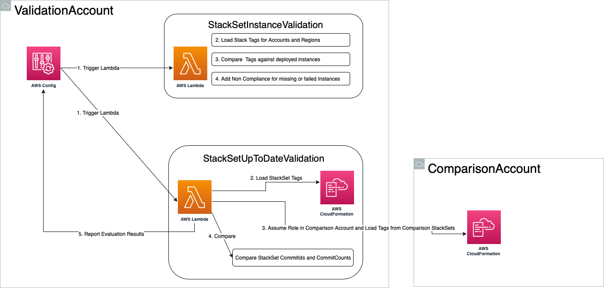

# Validate Stack Set Deployments Config Rule

When using StackSets one potential issue we have to resolve is adding new Accounts to the Organization, or AWS starting new Regions. Whenever that happens we want to make sure that the StackSets that should be in every account or every region are actually deployed.

This CloudFormation Stack creates an AWS Config Rule that will compare all StackSet Instances with Tags set on the StackSet. If they match it will set the StackSet as compliant. If its missing a StackSet it will set it as not compliant.



These Validation Config Rules should be deployed in every Account that manages StackSets, e.g. your Organizations Master Account or dedicated DevOps Accounts. This will make sure that all StackSets are properly up to date and their compliance is reported to the central AWS Config setup.

## Deploying the Config Rule

The AWS Config Rules to validate StackSets are deployed as a CloudFormation Stack.
The following command will create the stack, you can update and change it like any other Stack.

```
formica new -c stack.config.yaml
formica deploy -c stack.config.yaml
```

The code of the config rule is too large to embed directly into CloudFormation, so we're using `deployto` as a tool for deploying code updates. Once you create the stack as mentioned above you need to run `deployto` (make sure to install it with `pip install deployto` first) to update the code. You can check out the configuration for deployto in the `deployto.yml` file.

## Validating StackSet Instances are deployed successfully

You can use the following tags on a StackSet to configure the Accounts
and Regions it should be deployed to. Some of them should only be set
as boolean, some can take a list of accounts or regions that are
split with `/` as separator. We can't use ',' as a separator as it isn't
allowed in tag values.

When using the `Excluded` tags it will compare them to an up to date
list of accounts and regions and exclude the one listed. This makes
sure that if regions or accounts are added those will be non-compliant
until you add a StackSet instance.

```
tags:
  ValidateAllAccounts: true
  ValidateAllSubAccounts: true
  ValidateAccounts: 123456789/098765432
  ValidateExcludedAccounts: 987654321

  ValidateAllRegions: true
  ValidateRegions: eu-central-1/eu-west-1
  ValidateExcludedRegions: eu-west-1/us-west-1
```

## Non Compliance of StackSet Instances

There are different ways StackSet Instances can become NON_COMPLIANT:

* A StackSet has `Accounts` and `Regions` configured but the StackSet isn't deployed to an Account/Region combination
* A StackSet has `Accounts` and `Regions` configured and the StackSet is deployed but not in `CURRENT` or `RUNNING` state
* A StackSet has `Accounts` and `Regions` configured but an Instance is deployed not matching those tag configurations
* A StackSet has no tags configured and an instance is not in `CURRENT` or `RUNNING` state

All other StackSet Instances will be added in COMPLIANT state to AWS Config.

## Validating a StackSet is up to date in comparison to another accounts StackSets

When deploying StackSets into multiple environments you want to validate
that StackSets in your production account are regularly updated. To implement
this validation you can set StackSet Tags that will be picked up by the AWS Config
Rule and compare CommitIds with another StackSet either in the same or another account.

This way for example if you updated a StackSet in your staging account, but then didn't
update your production account within a Grace Period the production StackSet would
be non-compliant.

We're using both the `CommitId` as well as the `CommitCount` (number of commits on the branch
that was used for deployment) to compare. This makes sure that in instances where
the production account uses a later commit than staging we also have a higher commit count
and thus don't trigger a false compliance error as the commit ids are different after
the grace period, but everything is set up completely fine.

The following tags can be used on your StackSets. You have to set either the ComparisonAccount or ComparisonStackSetName tag
for the validation to validate the StackSet:

```
tags:
  **ComparisonAccount**: The account the target StackSet that we compare to is deployed in. If empty it compares to a StackSet in the same account (and you need to set the ComparisonStackSetName).
  **ComparisonStackSetName**: The name of the StackSet to compare to (or leave empty to use the same name)
  **GracePeriod**: Days after which a StackSet is marked as non-compliant if the CommitIds don't match and the CommitCount in the source StackSet is lower or equal to the commit count in the target StackSet. Testing against equal commit count is important as otherwise a commit could be amended and deployed which would lead to different commit ids but same commit counts so changes could be deployed without detecting it through the validation.
```

The following Tags are used for compliance calculations and should be set up automatically by your tooling:

```
CommitId: CommitId that was deployed
CommitCount: Number of commits on the current branch during deployment
LastUpdated: Timestamp
```

### Setting up Cross Account access

For cross account setup you need to create a role in the target account that allows access from the account where the AWS Config Rule is running. Use the cross-account-comparison Stack in the corresponding subfolder.

For instance to give `devops.production` access to `devops.staging` you can add following config to [staging.config.yaml](../staging.config.yaml).

```yaml
vars:
  ...
  stacksetValidationAccessFrom: ['687364868564']
  ...
```

To deploy this command use

```
cd cross-account-comparison
formica new --profile development.devops -c stack.config.yaml ../../development.config.yaml
formica deploy --profile development.devops -c stack.config.yaml ../../development.config.yaml
```
